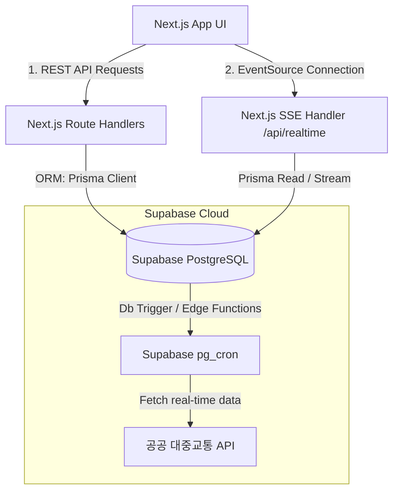

# TransitFlow 백엔드 및 데이터베이스(DB) 구현 기획서 (Supabase, Prisma, SSE 적용)

본 문서는 사용자의 요청에 따라 **Next.js Route Handlers(API 허브)**, **Prisma ORM**, **Supabase(PostgreSQL)** 및 **SSE(Server-Sent Events) 기반 실시간 위치 관제**를 접목한 풀스택 서버리스 아키텍처 기획안입니다. 

---

## 1. 개정된 백엔드 시스템 아키텍처

별도의 외부 백엔드 서버(NestJS 등)를 구축하는 대신, Next.js의 내장 기능인 **Route Handlers**를 API 허브 및 SSE 스트리밍 엔진으로 활용합니다. 데이터베이스 관리는 **Supabase**를 활용하여 데이터 영속화 및 백그라운드 트리거를 자동화합니다.



### 1.1 기술 스택 선정 사유
* **API 허브 (Next.js Route Handlers)**: Next.js 프레임워크 내에서 API 엔드포인트를 구현할 수 있어, 단일 코드베이스로 배포 및 관리가 가능하며 Edge Runtime 또는 Serverless 환경에 완벽 대응합니다.
* **데이터 제어기 (Prisma ORM)**: 선언적 스키마 파일(`schema.prisma`)을 기반으로 데이터베이스 타입을 완전 자동 생성하여, TypeScript 환경에서 최고의 타입 안정성(Type Safety)을 제공합니다.
* **데이터베이스 (Supabase / PostgreSQL)**: Supabase를 통해 인프라 구축 없이 클라우드 환경에서 관리형 PostgreSQL 데이터베이스를 즉시 운용할 수 있으며, 내장 Auth 기능과 테이블 변경 트래킹(Realtime)이 손쉽게 연동됩니다.
* **실시간 전송 (SSE: Server-Sent Events)**: 웹소켓(WebSocket)에 비해 설정이 가볍고 HTTP 프로토콜을 그대로 사용하므로 방화벽 프록시 문제가 적으며, 대중교통 위치 중계와 같은 **단방향 실시간 데이터 브로드캐스팅**에 최적의 성능을 냅니다.

---

## 2. Prisma ORM 데이터 모델 설계 (`schema.prisma`)

Supabase PostgreSQL 데이터베이스에 테이블을 생성하고 데이터를 제어하기 위한 Prisma 스키마 정의안입니다.

```prisma
datasource db {
  provider  = "postgresql"
  url       = env("DATABASE_URL")
  directUrl = env("DIRECT_URL") // Supabase 트랜잭션 풀링 대응용 다이렉트 연결 URL
}

generator client {
  provider = "prisma-client-js"
}

// 1. 위치/정류장 정보
model Location {
  id        String   @id @default(uuid())
  name      String
  type      String   // "subway" | "bus"
  detail    String   // 예: "3호선", "경의중앙선"
  latitude  Float?
  longitude Float?
  createdAt DateTime @default(now()) @map("created_at")

  startSegments Segment[] @relation("StartLocation")
  endSegments   Segment[] @relation("EndLocation")
  presetsStart  Preset[]  @relation("PresetStart")
  presetsEnd    Preset[]  @relation("PresetEnd")

  @@map("locations")
}

// 2. 대중교통 경로 (여러 세그먼트로 구성)
model Route {
  id            String    @id @default(uuid())
  title         String
  totalDuration Int       @map("total_duration")
  totalFare     Int       @map("total_fare")
  createdAt     DateTime  @default(now()) @map("created_at")
  segments      Segment[]
  presets       Preset[]

  @@map("routes")
}

// 3. 경로 내 세부 이동 구간
model Segment {
  id                  String   @id @default(uuid())
  routeId             String   @map("route_id")
  type                String   // "walk" | "subway" | "bus"
  lineName            String?  @map("line_name")
  startLocationId     String   @map("start_location_id")
  endLocationId       String   @map("end_location_id")
  durationMinutes     Int      @map("duration_minutes")
  fastTransferSection String?  @map("fast_transfer_section")
  direction           String?
  sequenceOrder       Int      @map("sequence_order")

  route         Route    @relation(fields: [routeId], references: [id], onDelete: Cascade)
  startLocation Location @relation("StartLocation", fields: [startLocationId], references: [id])
  endLocation   Location @relation("EndLocation", fields: [endLocationId], references: [id])

  @@map("segments")
}

// 4. 대중교통 실시간 특이사항 정보
model Incident {
  id          String   @id @default(uuid())
  transitName String   @map("transit_name")
  level       String   // "normal" | "warning" | "emergency"
  title       String
  description String   @db.Text
  updatedAt   DateTime @updatedAt @map("updated_at")
  sourceName  String?  @map("source_name")
  sourceUrl   String?  @map("source_url")

  @@map("incidents")
}

// 5. 자주 이용하는 경로 프리셋
model Preset {
  id              String   @id @default(uuid())
  userId          String   @map("user_id") // Supabase Auth UID 연동
  title           String
  startLocationId String   @map("start_location_id")
  endLocationId   String   @map("end_location_id")
  routeId         String   @map("route_id")
  createdAt       DateTime @default(now()) @map("created_at")

  startLocation Location @relation("PresetStart", fields: [startLocationId], references: [id])
  endLocation   Location @relation("PresetEnd", fields: [endLocationId], references: [id])
  route         Route    @relation(fields: [routeId], references: [id])

  @@map("presets")
}
```

---

## 3. Next.js Route Handlers API 상세 설계

### 3.1 경로 리스트 조회 API 핸들러
* **파일 위치**: `src/app/api/routes/route.ts`
* **기능**: Prisma Client를 통해 출발/도착역 정보를 조회하고 시간표 환승 매칭 로직을 적용해 옵션 반환.
```typescript
import { NextRequest, NextResponse } from 'next/server';
import { PrismaClient } from '@prisma/client';

const prisma = new PrismaClient();

export async function GET(request: NextRequest) {
  const { searchParams } = new URL(request.url);
  const startLocId = searchParams.get('startLocId');
  const endLocId = searchParams.get('endLocId');

  if (!startLocId || !endLocId) {
    return NextResponse.json({ error: 'Missing parameters' }, { status: 400 });
  }

  // Prisma를 이용한 경로 및 세그먼트 데이터 조인 쿼리 실행
  const routes = await prisma.route.findMany({
    where: {
      segments: {
        some: { startLocationId: startLocId }
      }
    },
    include: {
      segments: {
        orderBy: { sequenceOrder: 'asc' },
        include: { startLocation: true, endLocation: true }
      }
    }
  });

  // TODO: 가상 시간표 매칭 데이터 바인딩 및 정렬 로직 적용
  return NextResponse.json({ routes });
}
```

---

## 4. SSE 기반 실시간 교통수단 위치 관제 기획

지도(`VirtualMap.tsx`)상에서 실시간으로 대중교통(지하철, 버스)의 위치가 움직이고, 돌발 정보 변경 시 화면이 자동으로 즉시 갱신되도록 **SSE 단방향 실시간 이벤트 스트림**을 설계합니다.

### 4.1 SSE 연결 엔드포인트 핸들러
* **파일 위치**: `src/app/api/realtime/route.ts`
* **동작**: 클라이언트가 `EventSource`로 커넥션을 맺으면 `ReadableStream`을 응답하여 서버 지속 연결을 유지하고, 3초마다 교통수단의 실시간 GPS 정보(가상 연동 또는 API)를 패킷으로 내려보냅니다.

```typescript
import { NextRequest } from 'next/server';

export async function GET(request: NextRequest) {
  const { searchParams } = new URL(request.url);
  const routeId = searchParams.get('routeId');

  const encoder = new TextEncoder();

  // ReadableStream을 생성하여 청크 단위로 클라이언트에 전송
  const stream = new ReadableStream({
    async start(controller) {
      // 주기적으로 실시간 위치 패킷을 쏘아주는 타이머 설정 (3초 간격)
      const interval = setInterval(async () => {
        // 1. 공공 데이터 API 혹은 DB에서 실시간 위치 갱신값을 불러옴
        const coordinates = {
          segId: "seg-alt-2",
          lineName: "7727번 버스",
          currentX: 50 + Math.random() * 200, // 지도 SVG 좌표 비율 대응용
          currentY: 95 + (Math.sin(Date.now() / 1000) * 10),
          status: "정상 운행 중"
        };

        // 2. SSE 규격에 맞게 메시지 포맷팅 (event, data 구분)
        const sseData = `event: location-update\ndata: ${JSON.stringify(coordinates)}\n\n`;
        controller.enqueue(encoder.encode(sseData));
      }, 3000);

      // 클라이언트가 브라우저 창을 닫거나 연결을 해제할 때 타이머 정리
      request.signal.addEventListener('abort', () => {
        clearInterval(interval);
        controller.close();
      });
    }
  });

  // SSE에 필수적인 헤더 설정하여 응답 반환
  return new NextResponse(stream, {
    headers: {
      'Content-Type': 'text/event-stream',
      'Cache-Control': 'no-cache, no-transform',
      'Connection': 'keep-alive',
    },
  });
}
```

### 4.2 프론트엔드 연동 클라이언트 로직
* **용도**: `VirtualMap.tsx` 또는 `route-detail/page.tsx` 마운트 시 EventSource를 열어 실시간 위치 및 지연 안내를 수신하고, 마커 위치를 리렌더링 없이 부드럽게 좌표 이동(Transition animation)시킵니다.

```typescript
useEffect(() => {
  if (!selectedRouteId) return;

  // SSE 서버 엔드포인트에 접속
  const eventSource = new EventSource(`/api/realtime?routeId=${selectedRouteId}`);

  // 교통수단 실시간 위치 갱신 수신
  eventSource.addEventListener('location-update', (event: any) => {
    const rawData = JSON.parse(event.data);
    
    // GPS 상태값에 기반하여 맵 마커 위치 상태 업데이트
    // VirtualMap 컴포넌트에 넘겨 마커 실시간 이동 처리
    setLiveLocation({
      x: rawData.currentX,
      y: rawData.currentY,
      status: rawData.status
    });
  });

  return () => {
    eventSource.close(); // 컴포넌트 언마운트 시 연결 해제
  };
}, [selectedRouteId]);
```

---

## 5. 실제 지도 (Kakao / Naver Maps SDK) 연동 기획

현재 CSS/SVG 기반으로 제작된 가상 지도를 실제 지리 정보와 노선 라인이 그려지는 실제 상용 지도 API로 전환하기 위한 상세 사양입니다.

### 5.1 추천 지도 API 및 특징
* **카카오맵 (Kakao Maps API) [강력 추천]**
  * *장점*: 하루 30만 회의 넉넉한 무료 쿼터(할당량)를 제공하여 소규모 서비스나 개발 테스트용으로 완전 무료 운용이 가능합니다. 국내 지하철역 및 버스정류장 위치, 도로망 그래픽 해상도가 가장 뛰어납니다.
  * *라이브러리*: Next.js 환경에 맞게 최적화된 **`react-kakao-maps-sdk`**를 사용하면 지도 객체를 선언적으로 쉽게 렌더링할 수 있습니다.

### 5.2 Next.js 실제 지도 로드 기획 (카카오맵 기준)
Next.js의 `<Script>` 컴포넌트를 사용하여 최상위 레이아웃 혹은 지도 컴포넌트 마운트 전에 카카오 지도 SDK 스크립트를 로딩합니다.

```typescript
// src/app/layout.tsx 또는 지도 상위 레이아웃
import Script from 'next/script';

export default function RootLayout({ children }: { children: React.ReactNode }) {
  return (
    <html>
      <body>
        {children}
        {/* 카카오 지도 API 비동기 로드 */}
        <Script
          src={`//dapi.kakao.com/v2/maps/sdk.js?appkey=${process.env.NEXT_PUBLIC_KAKAO_MAP_KEY}&autoload=false`}
          strategy="beforeInteractive"
        />
      </body>
    </html>
  );
}
```

### 5.3 데이터베이스 좌표 데이터 보강
실제 지도에 핀(Marker)과 이동선(Polyline)을 그리기 위해, 기존 `locations` 테이블 및 `segments` 모델에 위도/경도 컬럼을 실제 수치로 마이그레이션합니다.
* `locations` 모델: `latitude` (Decimal), `longitude` (Decimal) 필드값 필수화.
* 원당역 좌표: `37.6531, 126.8327`
* 한국항공대역 좌표: `37.5996, 126.8653`

### 5.4 실제 지도 노선 드로잉 및 SSE 위치 동기화 의사 코드
가상 지도를 대체할 `VirtualMap.tsx` 내의 실제 지도 렌더링 설계 예시입니다:

```typescript
import { Map, MapMarker, Polyline } from 'react-kakao-maps-sdk';

export default function RealMap({ segments, liveBusGps }) {
  // 1. 모든 세그먼트의 위경도 좌표를 모아서 지도에 그려질 이동 경로 선(Polyline) 배열 생성
  const pathCoordinates = segments.map(seg => ({
    lat: seg.endLocation.latitude,
    lng: seg.endLocation.longitude
  }));

  // 2. 출발지 및 도착지 마커 핀 정의
  const startMarker = {
    lat: segments[0].startLocation.latitude,
    lng: segments[0].startLocation.longitude,
    title: "출발"
  };

  return (
    <Map
      center={startMarker} // 출발지 기준으로 지도 중심점 설정
      style={{ width: '100%', height: '220px' }}
      level={5} // 줌 배율 설정
    >
      {/* 출발지 마커 */}
      <MapMarker position={startMarker} />
      
      {/* 도착지 마커 */}
      <MapMarker position={{
        lat: segments[segments.length - 1].endLocation.latitude,
        lng: segments[segments.length - 1].endLocation.longitude
      }} />

      {/* 대중교통 노선 경로 실선 그리기 */}
      <Polyline
        path={[pathCoordinates]}
        strokeWeight={6}
        strokeColor="#3b82f6" // 버스는 파란색, 지하철은 주황색 등 동적 부여
        strokeOpacity={0.8}
        strokeStyle="solid"
      />

      {/* SSE로 받아온 실시간 버스/지하철 실시간 움직이는 GPS 핀 마커 */}
      {liveBusGps && (
        <MapMarker 
          position={{ lat: liveBusGps.lat, lng: liveBusGps.lng }}
          image={{
            src: "/images/bus-marker.png", // 버스 커스텀 핀 이미지
            size: { width: 24, height: 24 }
          }}
        />
      )}
    </Map>
  );
}
```
